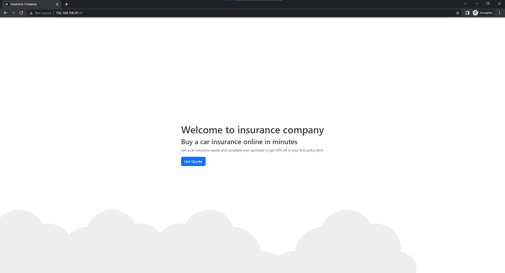
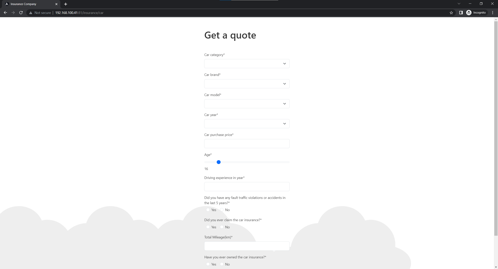
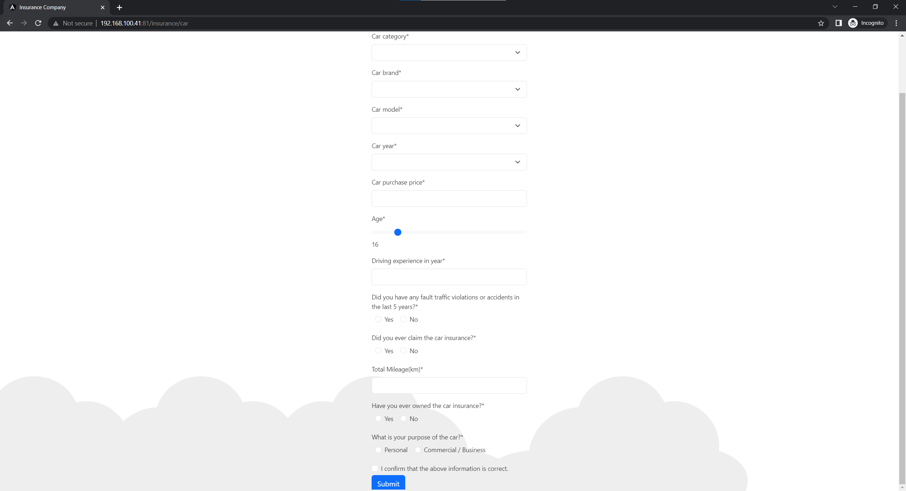
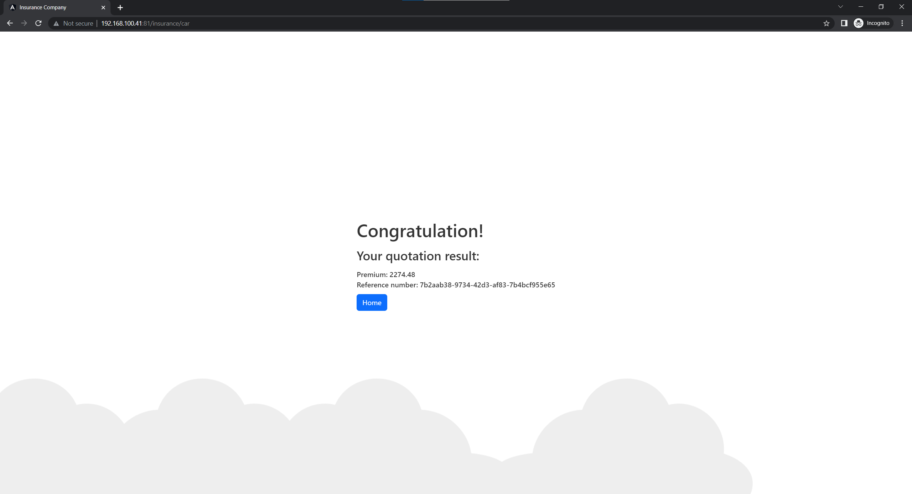
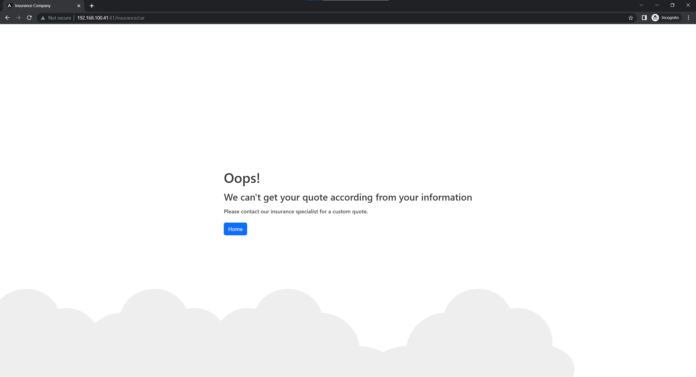
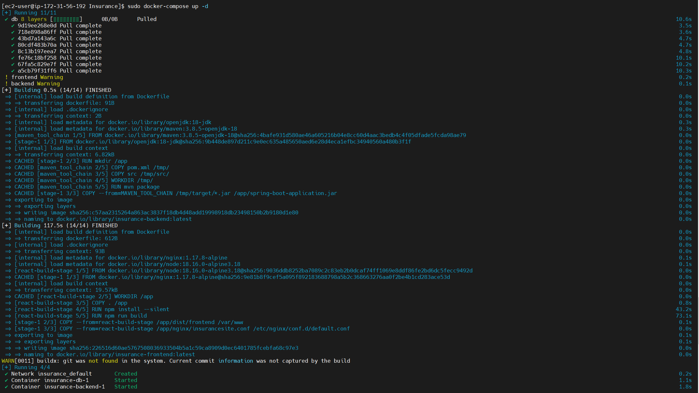

# Car insurance quotation application

This is a web application built with Angular and Spring Boot that provides vehicle insurance quotes. It consists of a
frontend webpage where users can input their details and receive a quote, and a backend webservice that calculates the
insurance premiums.

## Frontend Webpage

The frontend webpage built with Angular allows users to:

1. Enter driver's information such as age, driving experience, etc.
2. Provide vehicle information, including car models retrieved from car_model.json.
3. Display the quote for car insurance, along with a reference number.

## Backend Service

The backend webservice is developed using Spring Boot. It provides an API endpoint to calculate the insurance premium
based on the user's input and save the quote in the database.

## Technologies Used

- Front-end: Angular, Bootstrap
- Back-end: Spring boot, Cache
- Database: Mariadb
- Others: Nginx, Docker

## Running the Application

### Docker with compose environment (Recommend)

To run the website, follow these steps:

1. Prepare docker and docker-compose environment in Ubuntu OS
2. Change the current working directory that contains `docker-compose.yml` file
3. Run `sudo docker-compose up -d` to start the services
4. Be patient for the image build and run the unit tests process
5. Wait until all the services are up.
6. Access the website in your browser at http://{ip-address}

### Run with manual way

#### Frontend - Angular

1. Prepare npm environment in your operating system.
2. Open command prompt and change to the frontend directory.
3. Run `npm install` to install the dependencies.
4. Run `ng serve` to start the Angular development server.
5. Access the application in your browser at http://localhost:4200.

*Remark: change backend server address in the proxy.conf.json if needed.

#### Backend - Spring Boot

1. Prepare JAVA 18 and maven environment.
2. Open command prompt and change to the backend directory.
3. Run `mvn package` to build the project.
4. Change to target directory.
5. Run `java -jar insurance-0.0.1-SNAPSHOT.jar` to start the spring boot application

#### Database

By default application.properties, backend application is using in-memory database, replace the setting with below
reference.

```
spring.datasource.url=jdbc:mariadb://db:3306/example
spring.datasource.username=user
spring.datasource.password=password
spring.datasource.driver-class-name=org.mariadb.jdbc.Driver
spring.jpa.hibernate.ddl-auto=create-drop
```

## Final Notes

While working on this project, I faced a few challenges, such as handling different data validations, implementing the
frontend and backend integration, error handling, performing unit tests on each module, and designing a responsive user
interface. To overcome these challenges, I divided the tasks into smaller modules, used proper error handling, and
thoroughly tested the application at each stage.

## Preview





## Docker-compose running reference
